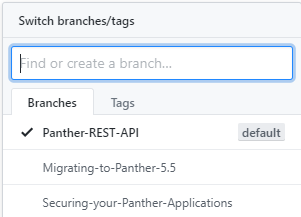

# Whitepapers
In this repository, you can find the whitepapers that have been written by Panther Product Team. This repository has three branches, in order to check the details please switch branches.

How to reach different branches, click on Branches on the above table head which will be present on the left.

Need a Panther Web 552 Redhat Image? [Click Here](https://hub.docker.com/r/prolificspanther/pantherweb)

[Click Here](https://www.prolifics.com/panther-trial-license-request) for a 45 day license.

How to setup a Panther Servlet Web Application? [Click Here](https://github.com/ProlificsPanther/PantherWeb/releases)

